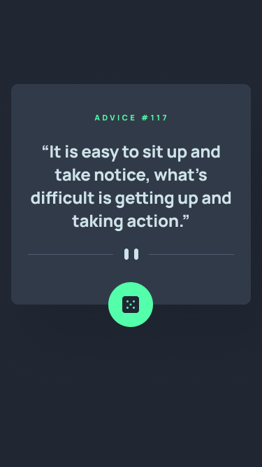

# React App Project

This project was bootstrapped with [Create React App](https://github.com/facebook/create-react-app).

Add dependencies:

- [axios](https://www.npmjs.com/package/axios)

Add devDependencies:

- [sass](https://www.npmjs.com/package/sass)

## Overview

### The challenge

Your challenge is to build out this advice generator app using the [Advice Slip API](https://api.adviceslip.com) and get it looking as close to the design as possible.

You can use any tools you like to help you complete the challenge. So if you've got something you'd like to practice, feel free to give it a go.

Your users should be able to:

- View the optimal layout for the app depending on their device's screen size
- See hover states for all interactive elements on the page
- Generate a new piece of advice by clicking the dice icon

### Screenshot

### Links

- Solution URL: [GitHub]()
- Live Site URL: [Netlify]()

## My process

### Built with

- Semantic HTML5 markup
- CSS custom properties
- Flexbox
- CSS Grid
- Mobile-first workflow
- [React](https://reactjs.org/) - JS library

## Author

- Website - [thicode.fr](https://thicode.fr/)
- Frontend Mentor - [@ThiCode126](https://www.frontendmentor.io/profile/ThiCode126)
- Twitter - [@code_thi](https://twitter.com/code_thi)
